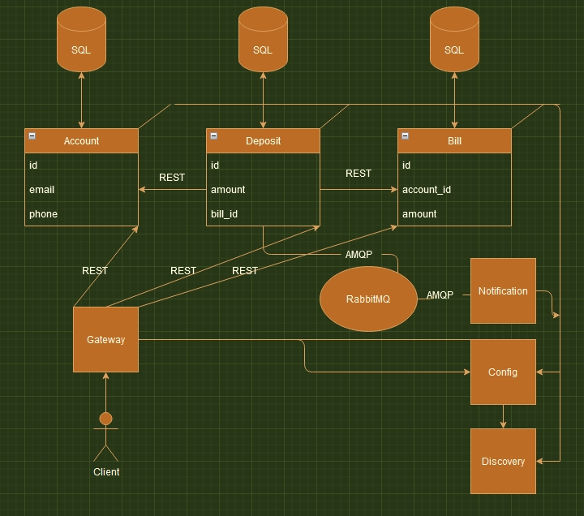

#Spring Cloud microservices

Приложение позволяющие зарегистрировать клиента,
зарегистрировать счета для клиента, и производить транзакции между счетами клиентов.

Архитектура:

Config-service:
Сервис конфигураций
Содержит конфигурационные настройки для микросервисов, такие как порты, настройки соединения с базой данных, и др.
Реализация от Spring Cloud Config

Registry:
Eureka реализация от Netflix
Сервис выполняет функции обнаружения других сервисов и регистриирует адреса этих сервисов.

Gateway:
Zuul реализация от Netflix
Сервис, который является единой точкой входа в приложение.

Account-service:
Взаимодействоет со своей базой данных паттерн CRUD
Работает с сущностью "Клиента"

Bill-service:
Взаимодействоет со своей базой данных паттерн CRUD
Работает с сущностью "Счет"

Deposit-service:
Взаимодействоет со своей базой данных паттерн CRUD
Позволяет пополнить "Счет" определенного "Клиента"
Работает с RabbitMQ

Notification-service:
Осуществляет отправку сообщения по email
Необходимо внести свои данные для работы (Стоит заглушка)

В качестве балансировщика используется Ribbon
В качестве HTTP клиента используется Feign

